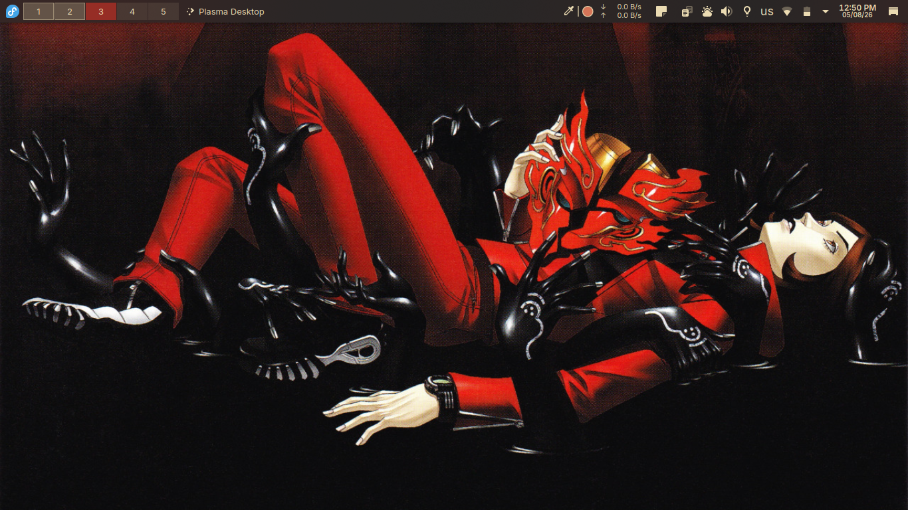
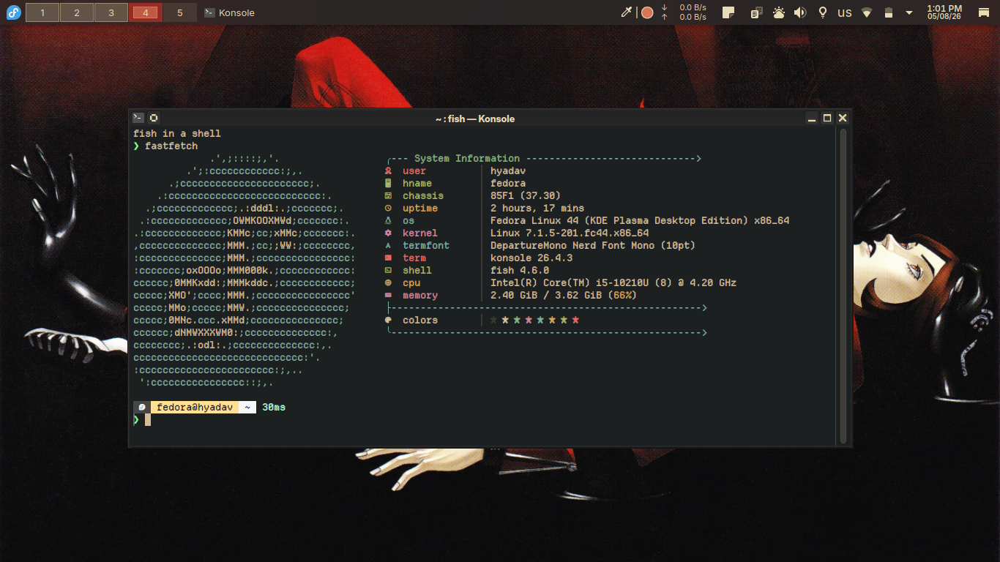
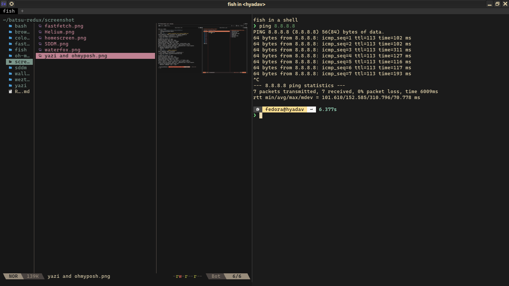
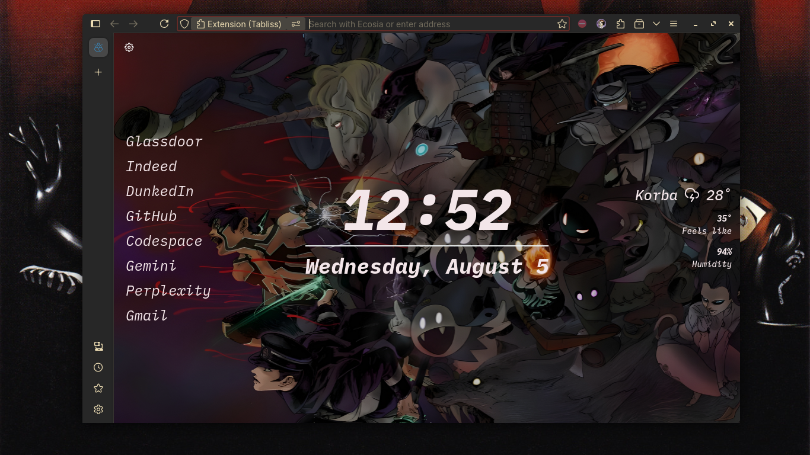

# 🍱 Batsu Redux

> My dotfiles collection for Linux & Windows.

## 📁 What's Included

| Component | Description |
| :--- | :--- |
| **Terminal** | [WezTerm](wezterm/) |
| **Prompt** | [Oh My Posh](oh-my-posh/) |
| **Shells** | [Fish](fish/) & [Bash](bash/) |
| **File Manager** | [Yazi](yazi/) |
| **Fetch Tool** | [Fastfetch](fastfetch/) |
| **Display Manager** | [sddm](sddm/) |
| **Color Schemes** | [Color Presets](colors/) |
| **Browser** | [Homepage Configs](browser-homepages/) |
| **Wallpapers** | [Wallpapers & Fetch Art](wallpaper-and-fetch-art/) |

---

## 📸 Gallery

Click to view screenshots

 

| Fastfetch | WezTerm |
| :---: | :---: |
|  |  |

| sddm Theme | Waterfox |
| :---: | :---: |
|  |  |

---

> [!NOTE]
> Please verify and update file paths in the config files to match your local setup environment.
